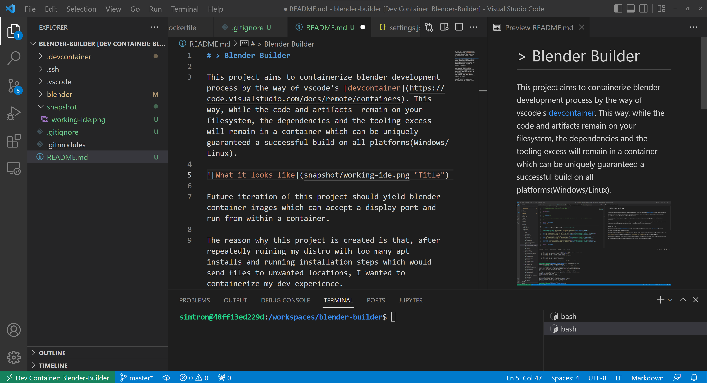
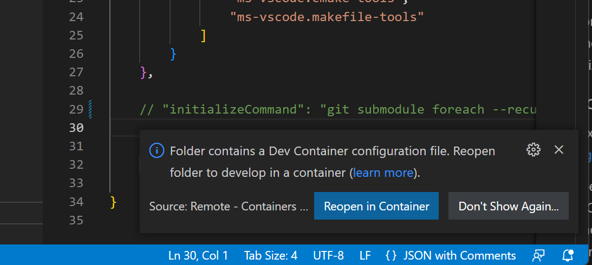
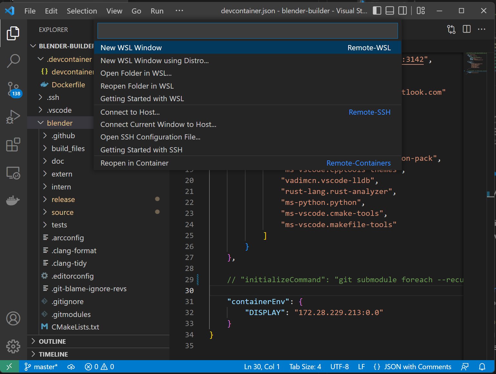
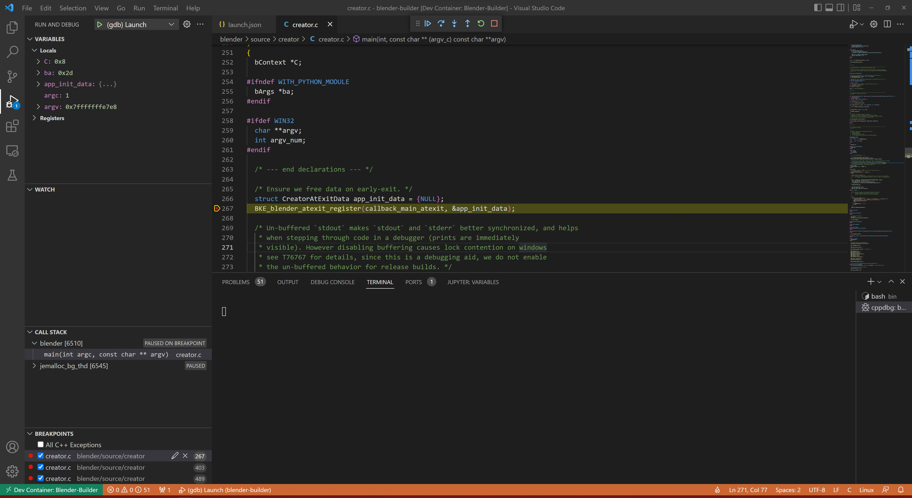
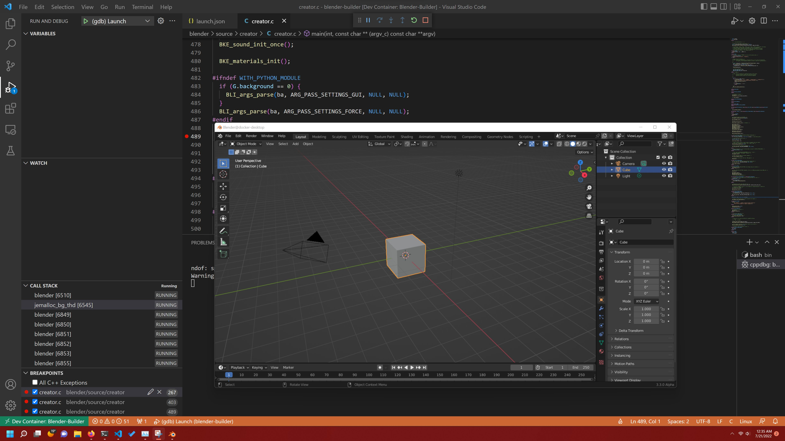

# > Blender Builder

## WIP - can contain things that can break

This project aims to containerize blender development process by the way of vscode's [devcontainer](https://code.visualstudio.com/docs/remote/containers). This way, while the code and artifacts  remain on your filesystem, the dependencies and the tooling excess will remain in a container which can be uniquely guaranteed a successful build on all platforms(Windows/Linux). 

Future iteration of this project should yield blender container images which can accept a display port and run from within a container.

The reason why this project is created is that, after repeatedly ruining my distro with too many apt installs and running installation steps which would send files to unwanted locations, I wanted to containerize my dev experience.

## How to use
You are expected to install [Remote Containers](https://marketplace.visualstudio.com/items?itemName=ms-vscode-remote.remote-containers) vscode extension. You are also encouraged to use [apt-cacher-ng](https://hub.docker.com/r/sameersbn/apt-cacher-ng) to prevent repeated downloads of the same repositories. 

1. Open the project directory `blender-builder` in vscode. 
2. VSCode would suggest opening the project inside a container. 
3. If not, use `ctrl+shift+p` to open operations popup and type `open folder in container` to start the same operation. 

If running for the first time, the VSCode would take significant time to build the container image before starting the workspace. You are encouraged to check the logs to see if all goes well / if it is stuck on something. If all goes well, you'd be back in vscode IDE with same folder opened - except inside the container.

## Some highlights
---
Blender GUI with IDE debugger attached inside devcontainer with Windows' `vscxsrv` for X-server on Windows.

